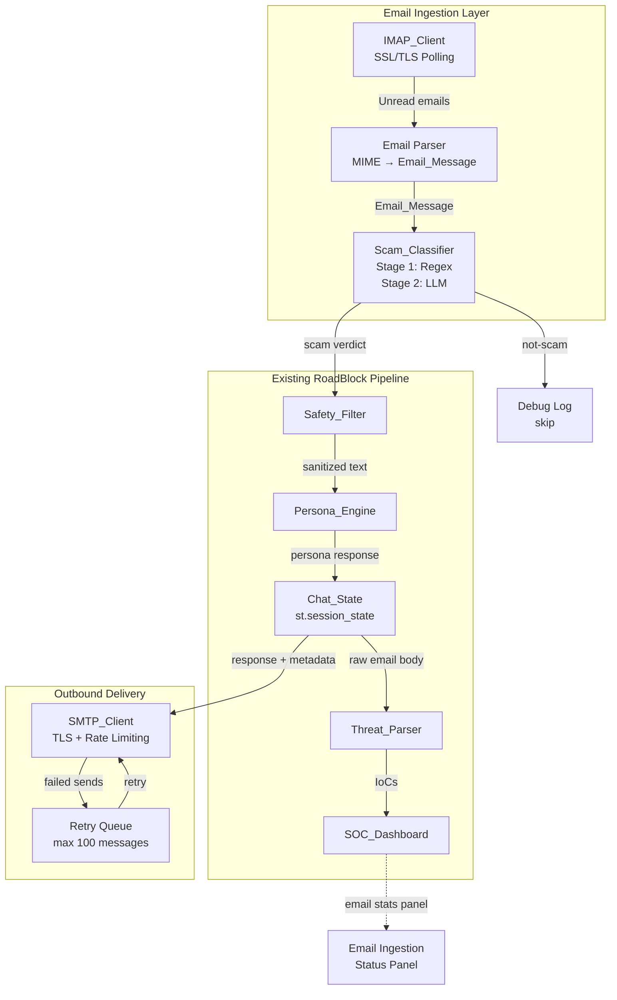
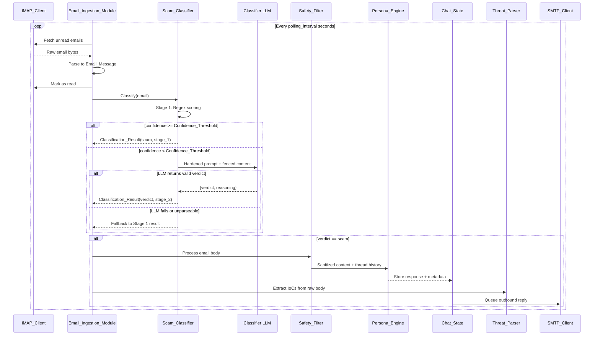

# Design Document: Email Scam Ingestion

## Overview

This design extends the RoadBlock honeypot pipeline with an automated email ingestion channel. The system polls an IMAP mailbox for unread emails, classifies them through a two-stage scam detection pipeline (regex weighted scoring → LLM confirmation with injection hardening), and feeds confirmed scam emails into the existing Safety_Filter → Persona_Engine → Threat_Parser engagement loop. Outbound persona responses are delivered back to scammers via SMTP, creating a fully autonomous email-based honeypot alongside the existing Streamlit manual input.

The design preserves RoadBlock's monolithic single-process architecture — all new state lives in `st.session_state`, no external databases are introduced, and new components follow the established one-component-per-module convention.

### Key Design Decisions

1. **Polling over push**: IMAP polling (configurable 10–300s interval) rather than IDLE/push avoids persistent connection management complexity within Streamlit's execution model.
2. **Two-stage classification**: Fast regex scoring handles obvious scams without LLM cost; LLM confirmation catches sophisticated scams that evade pattern matching.
3. **LLM hardening as defense-in-depth**: Content fencing, ignore-instructions system prompt, structured verdict validation, and injection-aware fallback logic prevent scammer emails from hijacking the classifier.
4. **Thread-based execution**: IMAP polling runs in a background thread with Streamlit's rerun-safe architecture, similar to the existing `_extraction_executor` pattern in `app.py`.
5. **Conversation threading by sender**: Each unique sender address maps to a conversation thread in `Chat_State`, enabling multi-turn engagement context.

## Architecture



### Sequence Diagram: Email Processing Flow



## Components and Interfaces

### 1. Email_Ingestion_Module (`components/email_ingestion.py`)

The orchestrator component that manages the IMAP polling loop, delegates to the Scam_Classifier, integrates with the existing pipeline, and triggers SMTP delivery.

```python
class EmailIngestionModule:
    """Orchestrates email fetching, classification, and pipeline integration."""

    def __init__(
        self,
        imap_client: IMAPClient,
        smtp_client: SMTPClient,
        scam_classifier: ScamClassifier,
        polling_interval: int = 30,  # seconds, 10–300
    ) -> None: ...

    def start_polling(self) -> None:
        """Start background IMAP polling thread."""

    def stop_polling(self) -> None:
        """Stop background polling and cleanup connections."""

    def process_email(self, email_msg: EmailMessage) -> None:
        """Classify and route a single email through the pipeline."""

    def _feed_to_pipeline(
        self, email_msg: EmailMessage, classification: ClassificationResult
    ) -> None:
        """Forward confirmed scam email into Safety_Filter → Persona_Engine flow."""

    def _handle_blocked_message(self, email_msg: EmailMessage) -> None:
        """Handle messages blocked by Safety_Filter (≥80% injection tokens)."""
```

### 2. IMAP_Client (`components/imap_client.py`)

Wraps Python's `imaplib` for IMAP operations with SSL/TLS, connection timeout, and error handling.

```python
class IMAPClient:
    """IMAP connection wrapper with SSL/TLS and fetch operations."""

    def __init__(
        self,
        host: str,       # from env: IMAP_HOST
        port: int,       # from env: IMAP_PORT (default 993)
        username: str,   # from env: IMAP_USERNAME
        password: str,   # from env: IMAP_PASSWORD
        timeout: float = 10.0,
    ) -> None: ...

    def connect(self) -> None:
        """Establish SSL/TLS connection and authenticate."""

    def fetch_unread(self) -> list[bytes]:
        """Fetch all unread email bytes from inbox."""

    def mark_as_read(self, message_uid: str) -> bool:
        """Mark a message as read (\\Seen flag). Returns success bool."""

    def disconnect(self) -> None:
        """Gracefully close IMAP connection."""

    @property
    def is_connected(self) -> bool:
        """Connection status check."""
```

### 3. SMTP_Client (`components/smtp_client.py`)

Wraps Python's `smtplib` for outbound email delivery with TLS, rate limiting, and retry queue management.

```python
class SMTPClient:
    """SMTP connection wrapper with TLS, rate limiting, and retry logic."""

    def __init__(
        self,
        host: str,           # from env: SMTP_HOST
        port: int,           # from env: SMTP_PORT (default 587)
        username: str,       # from env: SMTP_USERNAME
        password: str,       # from env: SMTP_PASSWORD
        sender_address: str, # from env: SMTP_SENDER
        timeout: float = 30.0,
        rate_limit_seconds: int = 60,  # per-recipient cooldown
        max_queue_size: int = 100,
    ) -> None: ...

    def send_reply(
        self,
        to_address: str,
        subject: str,
        body: str,
        in_reply_to: str | None = None,
        references: str | None = None,
    ) -> bool:
        """Send a reply email. Returns True on success."""

    def queue_message(self, message: OutboundEmail) -> bool:
        """Queue a message for deferred delivery. Returns False if queue full."""

    def process_retry_queue(self) -> None:
        """Attempt delivery of queued messages within rate limits."""
```

### 4. Scam_Classifier (`components/scam_classifier.py`)

Two-stage classification engine with regex pattern scoring and hardened LLM confirmation.

```python
class ScamClassifier:
    """Two-stage email scam classification with LLM hardening."""

    def __init__(
        self,
        patterns: list[ScamPattern],
        llm_client: Any,  # google.generativeai.GenerativeModel
        confidence_threshold: float = 0.7,
        fallback_threshold: float = 0.3,
        llm_timeout: float = 10.0,
    ) -> None: ...

    def classify(self, email: EmailMessage) -> ClassificationResult:
        """Run two-stage classification on an email."""

    def _stage_1_regex(self, subject: str, body: str) -> float:
        """Compute weighted regex confidence score (capped at 1.0)."""

    def _stage_2_llm(
        self, subject: str, body: str, stage_1_confidence: float
    ) -> ClassificationResult:
        """Invoke hardened LLM classification with content fencing."""

    def _build_hardened_prompt(self, subject: str, body: str) -> str:
        """Construct LLM prompt with delimiters and ignore-instructions directive."""

    def _validate_llm_response(self, response_text: str) -> dict | None:
        """Parse and validate LLM response against expected JSON schema."""
```

### 5. SOC Dashboard Extension (`dashboard/soc_dashboard.py`)

New panel methods added to the existing `SOCDashboard` class.

```python
# Added to existing SOCDashboard class:
def render_email_ingestion_panel(self, chat_state: dict) -> None:
    """Render email ingestion status: connection, counts, classification log."""

def render_classification_log(self, classifications: list) -> None:
    """Display recent 50 classification decisions in reverse chronological order."""
```

## Data Models

### New Models (`models/email_models.py`)

```python
from pydantic import BaseModel, Field, ConfigDict, field_validator
from datetime import datetime
from typing import Literal, Optional
import re


class EmailMessage(BaseModel):
    """Parsed email representation with validated fields."""

    model_config = ConfigDict(frozen=True)

    sender: str  # RFC 5322 addr-spec, max 254 chars
    subject: str = ""  # max 998 chars
    body: str  # non-empty after strip, max 1_000_000 chars
    message_id: str = ""
    reply_to: str = ""
    date_header: str = ""
    timestamp: datetime = Field(default_factory=datetime.utcnow)

    @field_validator("sender")
    @classmethod
    def validate_sender_email(cls, v: str) -> str:
        if len(v) > 254:
            raise ValueError("Sender address exceeds 254 characters")
        # Simplified RFC 5322 addr-spec validation
        if not re.match(r"^[^@\s]+@[^@\s]+\.[^@\s]+$", v):
            raise ValueError("Invalid email address format")
        return v

    @field_validator("subject")
    @classmethod
    def validate_subject_length(cls, v: str) -> str:
        if len(v) > 998:
            raise ValueError("Subject exceeds 998 characters")
        return v

    @field_validator("body")
    @classmethod
    def validate_body(cls, v: str) -> str:
        if not v.strip():
            raise ValueError("Body cannot be empty after stripping whitespace")
        if len(v) > 1_000_000:
            raise ValueError("Body exceeds 1,000,000 characters")
        return v


class ClassificationResult(BaseModel):
    """Output of the Scam_Classifier two-stage pipeline."""

    model_config = ConfigDict(frozen=True)

    verdict: Literal["scam", "not_scam"]
    confidence: float = Field(ge=0.0, le=1.0)
    determining_stage: Literal["stage_1", "stage_2"]
    matched_patterns: list[str] = Field(default_factory=list)
    llm_reasoning: str = ""
    timestamp: datetime = Field(default_factory=datetime.utcnow)
    sender: str = ""
    subject: str = ""


class ScamPattern(BaseModel):
    """A single regex pattern for scam detection with weight and category."""

    model_config = ConfigDict(frozen=True)

    name: str
    regex: str  # Raw regex string (compiled at classifier init)
    category: Literal["urgency", "financial_lure", "impersonation", "phishing"]
    weight: float = Field(ge=0.0, le=1.0)


class OutboundEmail(BaseModel):
    """An outbound email message queued for SMTP delivery."""

    model_config = ConfigDict(frozen=True)

    to_address: str
    subject: str  # "Re: " + original subject, max 255 chars
    body: str
    in_reply_to: str = ""
    references: str = ""
    status: Literal["pending", "pending_retry", "sent", "failed_permanent", "dropped_queue_full"] = "pending"
    retry_count: int = Field(default=0, ge=0)
    created_at: datetime = Field(default_factory=datetime.utcnow)
    last_attempt_at: Optional[datetime] = None


class EmailThreadMetadata(BaseModel):
    """Metadata for tracking email conversation threads by sender."""

    sender_address: str
    subject: str = ""
    message_ids: list[str] = Field(default_factory=list)
    source_channel: Literal["email"] = "email"
    message_count: int = 0
```

### Chat_State Extensions

New keys added to `st.session_state`:

```python
# Email ingestion state (added to initialize_chat_state defaults)
"email_ingestion": {
    "connection_status": "disconnected",  # connected | disconnected
    "total_fetched": 0,
    "total_scam": 0,
    "total_not_scam": 0,
    "outbound_sent": 0,
    "consecutive_failures": 0,
    "degraded_warning": False,
    "classification_log": [],  # max 200 ClassificationResult entries
    "outbound_queue": [],      # max 100 OutboundEmail entries
    "threads": {},             # sender_address → EmailThreadMetadata
}
```

## Correctness Properties

*A property is a characteristic or behavior that should hold true across all valid executions of a system — essentially, a formal statement about what the system should do. Properties serve as the bridge between human-readable specifications and machine-verifiable correctness guarantees.*

### Property 1: Email_Message serialization round-trip

*For any* valid `EmailMessage` instance, serializing to JSON and deserializing back SHALL produce an object with identical field values for sender, subject, body, and timestamp.

**Validates: Requirements 1.7, 6.6**

### Property 2: Classification_Result serialization round-trip

*For any* valid `ClassificationResult` instance, serializing to JSON and deserializing back SHALL produce an object with identical field values for verdict, confidence, and determining_stage.

**Validates: Requirements 6.7**

### Property 3: Confidence score bounded output

*For any* email processed by Stage 1 regex scoring and any set of weighted patterns, the computed confidence score SHALL be greater than or equal to 0.0 and less than or equal to 1.0.

**Validates: Requirements 7.6**

### Property 4: Zero-weight pattern invariant

*For any* set of scam patterns and any email, adding a pattern with weight 0.0 to the pattern set SHALL not change the confidence score produced by Stage 1.

**Validates: Requirements 7.5**

### Property 5: Stage 1 regex classification determinism

*For any* email and fixed classifier configuration, classifying the same email twice SHALL produce the same verdict, confidence, and determining_stage.

**Validates: Requirements 2.11**

### Property 6: Threshold routing correctness

*For any* email and valid threshold configuration, if Stage 1 confidence ≥ Confidence_Threshold then the classifier SHALL produce a result with `determining_stage = "stage_1"` without invoking the LLM; conversely, if Stage 1 confidence < Confidence_Threshold then Stage 2 SHALL be invoked.

**Validates: Requirements 2.3, 2.4, 3.3, 3.4**

### Property 7: Threshold validation rejects invalid ranges

*For any* float value outside [0.0, 1.0], attempting to initialize the Scam_Classifier with that value as Confidence_Threshold or Fallback_Threshold SHALL raise a validation error.

**Validates: Requirements 3.5, 3.6**

### Property 8: Fallback-greater-than-confidence rejection

*For any* pair of floats where Fallback_Threshold > Confidence_Threshold (both in [0.0, 1.0]), attempting to initialize the Scam_Classifier SHALL raise a validation error.

**Validates: Requirements 3.7**

### Property 9: LLM response validation rejects non-conforming output

*For any* string that does not parse as JSON with exactly a "verdict" field of value "scam" or "not-scam" and a "reasoning" field of type string, the `_validate_llm_response` method SHALL return None (indicating rejection).

**Validates: Requirements 2.7, 2.9**

### Property 10: Outbound subject line length invariant

*For any* original subject string, the composed reply subject ("Re: " + truncated original) SHALL have a total length ≤ 255 characters.

**Validates: Requirements 5.1**

### Property 11: Classification log capacity invariant

*For any* sequence of classification results stored in Chat_State, the classification log SHALL never exceed 200 entries, with the oldest entries evicted first when the limit is reached.

**Validates: Requirements 8.2**

### Property 12: Classification log ordering

*For any* set of classification results in the log, the displayed entries SHALL be in reverse chronological order (newest timestamp first).

**Validates: Requirements 8.4**

### Property 13: Conversation threading by sender

*For any* sequence of emails from the same sender address, all emails SHALL be appended to the same conversation thread in Chat_State, and the Persona_Engine SHALL receive the accumulated thread history when generating responses.

**Validates: Requirements 4.7**

## Error Handling

### IMAP Connection Failures

- Log at warning level on connection/auth failure
- Retry on next polling interval — no crash propagation
- Track consecutive failures: after 3, emit `degraded_warning` to SOC Dashboard
- On successful reconnect: clear warning, reset counter to zero

### Email Parse Failures

- Mark malformed email as read (prevent infinite retry)
- Log at warning with Message-ID
- Skip and continue processing remaining emails
- Graceful degradation: partial batch results always returned

### LLM Classification Failures

- Timeout (10s), network error, empty response, unparseable response → all trigger fallback
- Fallback logic: if Stage 1 confidence ≥ Fallback_Threshold → classify as scam; otherwise → not-scam
- Unparseable LLM response treated as potential injection success — logged at warning
- Never crash the ingestion loop on LLM failure

### SMTP Delivery Failures

- Log at warning, mark message as `pending_retry` in Chat_State
- After 3 consecutive failures for same message → `failed_permanent`, cease retries
- Queue saturation (100 messages) → reject new messages with `dropped_queue_full` status
- Rate limit exceeded → defer to queue, deliver when window allows

### Pipeline Integration Failures

- Wrap `process_scammer_message` call in try/except
- On failure: log warning, skip email, continue with next
- Never crash the polling loop due to downstream pipeline errors

## Testing Strategy

### Property-Based Testing (Hypothesis)

Property-based testing is the primary validation approach for this feature. The following correctness properties are encoded as executable Hypothesis tests:

- **Library**: Hypothesis (already in project dependencies)
- **Minimum iterations**: 100 per property test (configured via `@settings(max_examples=200)`)
- **Tag format**: `Feature: email-scam-ingestion, Property {N}: {description}`

Properties 1–13 above are each implemented as a single `@given` test with appropriate Hypothesis strategies for generating:
- Valid `EmailMessage` instances (random RFC 5322 addresses, subjects, bodies)
- Valid `ClassificationResult` instances (enum-sampled verdicts, float confidences)
- Random pattern sets with varying weights
- Edge-case LLM response strings (valid JSON, malformed JSON, injection attempts)
- Subject lines of varying length for truncation testing

### Unit Tests (Example-Based)

- IMAP connection/auth success and failure scenarios (mocked `imaplib`)
- Email MIME parsing: multipart with text/plain, text/html-only fallback, no text parts
- Mark-as-read success and failure paths
- Scam_Classifier Stage 2 LLM prompt construction (verify delimiters present)
- SMTP send with threading headers (In-Reply-To, References)
- Rate limiting enforcement and queue saturation behavior
- SOC Dashboard panel rendering with email ingestion state
- Conversation threading: multiple emails from same sender share thread

### Integration Tests

- Full pipeline flow: email → classify → Safety_Filter → Persona_Engine → SMTP reply
- Blocked message flow: Safety_Filter blocks → default response → still extract IoCs
- LLM fallback scenarios: timeout, malformed response, injection-like response
- Degraded warning lifecycle: 3 failures → warning → reconnect → clear

### Edge Cases

- Empty subject field (treated as empty string for regex matching)
- Body at exactly 1,000,000 characters
- Subject at exactly 998 characters
- Reply subject truncation at 255 character boundary
- Confidence_Threshold = 0.0 (all matched emails skip Stage 2)
- Confidence_Threshold = 1.0 (always invoke Stage 2)
- Queue at exactly 100 messages (next message rejected)
- Mark-as-read failure followed by reattempt on next cycle
