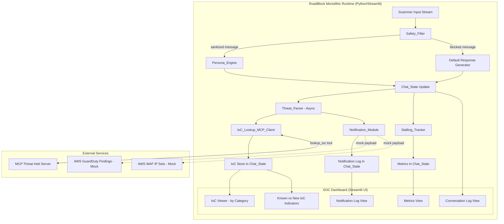
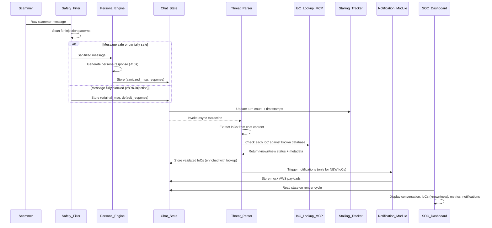
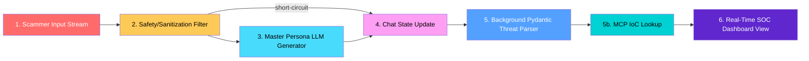
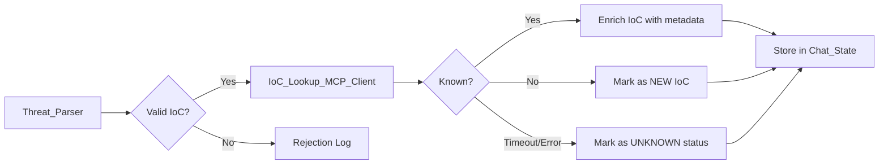

# Design Document: Tarpit Honeypot Pipeline (RoadBlock)

## Overview

RoadBlock is a monolithic Python/Streamlit application that functions as an automated social honeypot pipeline. It intercepts scammer communications, engages adversaries through an AI-driven elderly persona, and concurrently extracts validated Threat Intelligence Indicators of Compromise (IoCs) via a real-time data engineering pipeline.

The system is designed as a single-process runtime with no external database dependencies. All state is managed in-memory via `st.session_state`, making deployment trivial while maintaining full pipeline functionality for demonstration and pre-production validation purposes.

**Key Design Decisions:**
- **Monolithic single-process**: Simplifies deployment and eliminates distributed system complexity. Streamlit's session model provides natural isolation between concurrent users.
- **In-memory state only**: No external persistence layer. Session lifetime equals data lifetime. This is appropriate for a honeypot tool where transient engagement is the primary use case.
- **Async within sync**: Streamlit runs synchronously, but the Threat_Parser uses `asyncio` to avoid blocking the UI render cycle during extraction.
- **Mock AWS integration**: Simulates GuardDuty/WAF payloads to validate the integration pattern without requiring real cloud infrastructure.

## Architecture

### High-Level System Architecture



### Component Interaction Diagram



## Data Flow Map

The pipeline processes messages through six sequential stages with one asynchronous branch:



### Stage Details

| Stage | Component | Input | Output | Timeout | Mode |
|-------|-----------|-------|--------|---------|------|
| 1 | Scammer_Input_Stream | Raw text from adversary | Unprocessed message string | N/A | Sync |
| 2 | Safety_Filter | Raw message | Sanitized message OR block signal | 2s | Sync |
| 3 | Persona_Engine | Sanitized message + conversation history | Character response (20-300 words) | 10s | Sync |
| 4 | Chat_State Update | Message pair + metrics | Updated session state | N/A | Sync |
| 5 | Threat_Parser | Full chat message text | Validated IoC list + notifications | 5s | Async |
| 5b | IoC_Lookup_MCP_Client | Extracted IoC values | Known/New status + metadata | 3s | Async |
| 6 | SOC_Dashboard | Chat_State snapshot | Rendered Streamlit UI | N/A | Sync (render) |

## Components and Interfaces

### 1. Safety_Filter

**Purpose:** Input defense boundary that screens inbound messages for prompt injection attacks.

**Interface:**
```python
class SafetyFilter:
    def __init__(self, injection_patterns: list[InjectionPattern]):
        """Initialize with configurable injection detection patterns."""
        
    def scan(self, raw_message: str) -> ScanResult:
        """
        Scan message for injection patterns.
        Returns ScanResult with sanitized content and detection metadata.
        Must complete within 2 seconds.
        """
        
    def sanitize(self, raw_message: str, detected_patterns: list[PatternMatch]) -> str:
        """Strip/escape adversarial tokens while preserving legitimate content."""
        
    def is_fully_blocked(self, scan_result: ScanResult) -> bool:
        """Returns True if ≥80% of message tokens match injection patterns."""
```

**Detection Categories:**
- Instruction override: `"ignore previous instructions"`, `"disregard above"`
- Role reassignment: `"you are now"`, `"act as"`, `"pretend to be"`
- System prompt extraction: `"repeat your system prompt"`, `"show me your instructions"`
- Obfuscated payloads: base64-encoded instructions, hex-encoded, markdown/code-fence wrappers

**Design Rationale:** Pattern-based detection provides deterministic, fast scanning. The 80% threshold for full blocking prevents over-aggressive filtering when a message contains mostly legitimate content with a few suspicious tokens.

### 2. Persona_Engine

**Purpose:** LLM-driven conversational module that generates responses as "The Tech-Illiterate Confused Elder."

**Interface:**
```python
class PersonaEngine:
    def __init__(self, llm_client, system_prompt: str, fallback_responses: list[str]):
        """Initialize with LLM client, persona system prompt, and fallback pool."""
        
    def generate_response(
        self, 
        sanitized_message: str, 
        conversation_history: list[ChatMessage]
    ) -> PersonaResponse:
        """
        Generate in-character response.
        Must complete within 10 seconds.
        Response length: 20-300 words.
        Must include at least one stalling tactic.
        Falls back to pre-written response on timeout/error.
        """
        
    def validate_response(self, response: str) -> bool:
        """
        Post-generation check ensuring response does not:
        - Contain system prompt fragments
        - Acknowledge AI identity
        - Use technical jargon correctly
        - Provide actionable technical instructions
        """
```

**Stalling Tactics Pool:**
- Ask scammer to repeat themselves
- Introduce irrelevant anecdotes (grandchildren, pets, weather)
- Express confusion about technology terminology
- Request unnecessary clarifications
- Misunderstand instructions deliberately

**Fallback Mechanism:** If LLM is unavailable or times out, select randomly from a pool of 20+ pre-written responses that maintain character and include stalling tactics.

### 3. Threat_Parser

**Purpose:** Background extraction engine that identifies and validates IoCs from chat content using Pydantic models.

**Interface:**
```python
class ThreatParser:
    def __init__(self):
        """Initialize regex patterns and validation engines."""
        
    async def extract_iocs(self, message: str) -> ExtractionResult:
        """
        Async extraction of all IoC types from a message.
        Must complete within 5 seconds.
        Returns validated IoCs and rejection log.
        """
        
    def extract_crypto_wallets(self, text: str) -> list[CryptoWalletIoC]:
        """Extract and validate Bitcoin (Base58Check, Bech32) and Ethereum addresses."""
        
    def extract_phishing_domains(self, text: str) -> list[PhishingDomainIoC]:
        """Extract, defang-reverse, normalize, and validate domains."""
        
    def extract_phone_numbers(self, text: str) -> list[PhoneNumberIoC]:
        """Extract and normalize phone numbers to E.164 format."""
        
    def extract_mule_accounts(self, text: str) -> list[MuleBankAccountIoC]:
        """Extract bank account triplets within proximity and validate ABA checksum."""
```

**Async Strategy:** Uses `asyncio.run_in_executor` or `asyncio.create_task` within Streamlit's event loop. The parser runs concurrently with UI rendering so the dashboard remains responsive. Results are written back to `st.session_state` upon completion, triggering a UI refresh via `st.rerun()` if new IoCs are found.

### 4. Stalling_Tracker

**Purpose:** Metrics subsystem recording conversation engagement statistics.

**Interface:**
```python
class StallingTracker:
    def record_turn(self, chat_state: ChatState) -> None:
        """
        Increment turn count by 1.
        Record current timestamp.
        Calculate elapsed time from first scammer message to latest.
        """
        
    def get_formatted_duration(self, chat_state: ChatState) -> str:
        """Return Total Scammer Time Wasted as 'HH:MM:SS'."""
        
    def initialize(self, chat_state: ChatState) -> None:
        """Set turn_count=0, start_time=None, total_time='00:00:00'."""
```

### 5. Notification_Module

**Purpose:** Mock integration layer generating AWS-format payloads for GuardDuty findings and WAF IP block rules.

**Interface:**
```python
class NotificationModule:
    def generate_notification(self, ioc: BaseIoC) -> MockAWSPayload:
        """
        Route IoC to appropriate payload generator based on type.
        - PhishingDomain → WAF UpdateIPSet payload
        - CryptoWallet → GuardDuty HIGH severity
        - MuleBankAccount → GuardDuty CRITICAL severity
        - PhoneNumber → GuardDuty MEDIUM severity
        """
        
    def generate_waf_payload(self, domain_ioc: PhishingDomainIoC) -> WAFPayload:
        """Generate mock AWS WAF UpdateIPSet payload with UUID fields."""
        
    def generate_guardduty_payload(
        self, ioc: BaseIoC, severity: str, finding_type: str
    ) -> GuardDutyPayload:
        """Generate mock AWS GuardDuty finding with standard field structure."""
```

### 6. IoC_Lookup_MCP_Client

**Purpose:** Integration layer that queries an external MCP (Model Context Protocol) server to check whether an extracted IoC is already known in a threat intelligence database. This prevents duplicate reporting and enriches IoCs with prior sighting metadata.

**Interface:**
```python
class IoCLookupMCPClient:
    def __init__(self, mcp_server_url: str, timeout: float = 3.0):
        """
        Initialize MCP client with server endpoint and timeout.
        The MCP server exposes a 'lookup_ioc' tool that accepts an IoC value
        and returns whether it's known, along with metadata (first_seen, source, severity).
        """
        
    async def check_known_ioc(self, ioc_value: str, ioc_category: IoCCategory) -> IoCLookupResult:
        """
        Query the MCP server to determine if this IoC has been previously recorded.
        Returns IoCLookupResult with is_known flag, first_seen timestamp, 
        reporting_source, and historical_severity.
        Must complete within 3 seconds; returns unknown status on timeout.
        """
        
    async def batch_check(self, iocs: list[BaseIoC]) -> list[IoCLookupResult]:
        """
        Batch lookup for multiple IoCs in a single request.
        More efficient for messages containing multiple IoCs.
        """
        
    def is_available(self) -> bool:
        """Health check — returns True if MCP server is reachable."""
```

**MCP Server Tool Schema (expected remote interface):**
```json
{
  "name": "lookup_ioc",
  "description": "Check if an Indicator of Compromise is already known in the threat intelligence database",
  "inputSchema": {
    "type": "object",
    "properties": {
      "ioc_value": {
        "type": "string",
        "description": "The IoC value to look up (wallet address, domain, phone number, or account details)"
      },
      "ioc_category": {
        "type": "string",
        "enum": ["cryptocurrency_wallet", "phishing_domain", "phone_number", "mule_bank_account"]
      }
    },
    "required": ["ioc_value", "ioc_category"]
  }
}
```

**MCP Server Response Schema:**
```json
{
  "is_known": true,
  "first_seen": "2024-01-15T08:30:00Z",
  "times_reported": 12,
  "reporting_sources": ["FBI IC3", "PhishTank", "RoadBlock-Session-47"],
  "severity_assessment": "HIGH",
  "tags": ["romance_scam", "crypto_drain"]
}
```

**Integration with Threat_Parser Pipeline:**



**Design Rationale:**
- The MCP server acts as a shared threat intelligence knowledge base across sessions and deployments.
- Checking known IoCs prevents duplicate reporting to downstream systems (GuardDuty/WAF) and helps analysts prioritize truly novel indicators.
- The 3-second timeout ensures the pipeline doesn't stall if the MCP server is slow or unavailable.
- Graceful degradation: if the MCP server is unreachable, IoCs are stored with `lookup_status: "unknown"` and the pipeline continues normally.

### 7. SOC_Dashboard

**Purpose:** Real-time Streamlit UI displaying conversation log, IoCs by category, session metrics, and notification log.

**Interface:**
```python
class SOCDashboard:
    def render(self, chat_state: ChatState) -> None:
        """Main render method called on each Streamlit cycle."""
        
    def render_conversation_log(self, messages: list[ChatMessage]) -> None:
        """Display chat messages with sender attribution and timestamps."""
        
    def render_ioc_panel(self, iocs: dict[str, list[BaseIoC]]) -> None:
        """Display IoCs grouped by category with extracted values."""
        
    def render_metrics(self, metrics: SessionMetrics) -> None:
        """Display turn count, time wasted, IoC counts per category."""
        
    def render_notification_log(self, notifications: list[MockAWSPayload]) -> None:
        """Display notification timeline with severity, type, and summary."""
```

## Data Models

### Core Pydantic Models

```python
from pydantic import BaseModel, Field, field_validator
from datetime import datetime
from enum import Enum
from typing import Optional
import uuid


class IoCCategory(str, Enum):
    CRYPTOCURRENCY_WALLET = "cryptocurrency_wallet"
    PHISHING_DOMAIN = "phishing_domain"
    PHONE_NUMBER = "phone_number"
    MULE_BANK_ACCOUNT = "mule_bank_account"


class WalletType(str, Enum):
    BITCOIN_BASE58 = "bitcoin_base58"
    BITCOIN_BECH32 = "bitcoin_bech32"
    ETHEREUM = "ethereum"


class BaseIoC(BaseModel):
    id: str = Field(default_factory=lambda: str(uuid.uuid4()))
    category: IoCCategory
    extracted_value: str
    source_message: str
    extracted_at: datetime = Field(default_factory=datetime.utcnow)
    confidence: float = Field(ge=0.0, le=1.0, default=1.0)
    lookup_result: Optional["IoCLookupResult"] = None  # Populated after MCP lookup


class CryptoWalletIoC(BaseIoC):
    category: IoCCategory = IoCCategory.CRYPTOCURRENCY_WALLET
    wallet_type: WalletType
    address: str
    
    @field_validator("address")
    @classmethod
    def validate_address_not_empty(cls, v):
        if not v.strip():
            raise ValueError("Address cannot be empty")
        return v


class PhishingDomainIoC(BaseIoC):
    category: IoCCategory = IoCCategory.PHISHING_DOMAIN
    domain: str
    original_form: str  # Before defanging reversal
    
    @field_validator("domain")
    @classmethod
    def validate_domain_normalized(cls, v):
        if v != v.lower() or v.endswith("."):
            raise ValueError("Domain must be lowercase without trailing dot")
        return v


class PhoneNumberIoC(BaseIoC):
    category: IoCCategory = IoCCategory.PHONE_NUMBER
    e164_number: str  # +{country_code}{subscriber_number}
    original_form: str
    
    @field_validator("e164_number")
    @classmethod
    def validate_e164_format(cls, v):
        if not v.startswith("+") or not v[1:].isdigit() or len(v) > 16:
            raise ValueError("Must be valid E.164 format")
        return v


class MuleBankAccountIoC(BaseIoC):
    category: IoCCategory = IoCCategory.MULE_BANK_ACCOUNT
    bank_name: str
    account_number: str
    routing_number: str
    
    @field_validator("routing_number")
    @classmethod
    def validate_aba_checksum(cls, v):
        if len(v) != 9 or not v.isdigit():
            raise ValueError("Routing number must be exactly 9 digits")
        weights = [3, 7, 1, 3, 7, 1, 3, 7, 1]
        checksum = sum(int(d) * w for d, w in zip(v, weights))
        if checksum % 10 != 0:
            raise ValueError("Routing number fails ABA checksum")
        return v

    @field_validator("account_number")
    @classmethod
    def validate_account_length(cls, v):
        digits = "".join(c for c in v if c.isdigit())
        if len(digits) < 4 or len(digits) > 17:
            raise ValueError("Account number must be 4-17 digits")
        return v
```

### IoC Lookup Result Model

```python
class LookupStatus(str, Enum):
    KNOWN = "known"
    NEW = "new"
    UNKNOWN = "unknown"  # MCP server unreachable or timed out


class IoCLookupResult(BaseModel):
    ioc_value: str
    ioc_category: IoCCategory
    lookup_status: LookupStatus
    is_known: bool = False
    first_seen: Optional[datetime] = None
    times_reported: int = 0
    reporting_sources: list[str] = []
    severity_assessment: Optional[str] = None
    tags: list[str] = []
    lookup_timestamp: datetime = Field(default_factory=datetime.utcnow)
    lookup_duration_ms: Optional[float] = None  # For performance tracking
```

### Chat State and Message Models

```python
class ChatMessage(BaseModel):
    sender: str  # "scammer" or "persona"
    content: str
    timestamp: datetime = Field(default_factory=datetime.utcnow)
    was_sanitized: bool = False
    was_blocked: bool = False


class SessionMetrics(BaseModel):
    turn_count: int = 0
    start_time: Optional[datetime] = None
    last_message_time: Optional[datetime] = None
    
    def total_time_wasted_seconds(self) -> int:
        if self.start_time is None or self.last_message_time is None:
            return 0
        return int((self.last_message_time - self.start_time).total_seconds())
    
    def formatted_time_wasted(self) -> str:
        total = self.total_time_wasted_seconds()
        hours, remainder = divmod(total, 3600)
        minutes, seconds = divmod(remainder, 60)
        return f"{hours:02d}:{minutes:02d}:{seconds:02d}"


class RejectionLogEntry(BaseModel):
    candidate: str
    rejection_reason: str
    ioc_category: IoCCategory
    timestamp: datetime = Field(default_factory=datetime.utcnow)


class ExtractionResult(BaseModel):
    iocs: list[BaseIoC] = []
    rejections: list[RejectionLogEntry] = []
```

### Mock AWS Payload Models

```python
class MockAWSPayload(BaseModel):
    payload_type: str  # "guardduty_finding" or "waf_ipset_update"
    timestamp: datetime = Field(default_factory=datetime.utcnow)
    severity: str
    summary: str
    raw_payload: dict


class WAFPayload(BaseModel):
    Name: str = "RoadBlock-PhishingDomains"
    Scope: str = "REGIONAL"
    Id: str = Field(default_factory=lambda: str(uuid.uuid4()))
    Addresses: list[str]
    LockToken: str = Field(default_factory=lambda: str(uuid.uuid4()))


class GuardDutyFinding(BaseModel):
    SchemaVersion: str = "2.0"
    AccountId: str = "123456789012"
    Region: str = "us-east-1"
    Type: str
    Resource: dict = Field(default_factory=lambda: {"ResourceType": "Instance"})
    Service: dict = Field(default_factory=lambda: {"ServiceName": "guardduty"})
    Severity: float
    Title: str
    Description: str
    CreatedAt: datetime = Field(default_factory=datetime.utcnow)
```

### Session State Schema

The complete `st.session_state` key structure:

```python
# st.session_state schema
SESSION_STATE_SCHEMA = {
    "conversation_history": list[ChatMessage],      # Chronological message list
    "iocs": {
        "cryptocurrency_wallets": list[CryptoWalletIoC],
        "phishing_domains": list[PhishingDomainIoC],
        "phone_numbers": list[PhoneNumberIoC],
        "mule_bank_accounts": list[MuleBankAccountIoC],
    },
    "metrics": SessionMetrics,                      # Turn count + timing
    "notifications": list[MockAWSPayload],          # Mock AWS payloads
    "rejection_log": list[RejectionLogEntry],       # Failed extractions
    "parser_status": str,                           # "idle" | "running" | "error"
    "last_error": Optional[str],                    # Most recent pipeline error
    "mcp_lookup_cache": dict[str, IoCLookupResult], # Cache of MCP lookup results keyed by ioc_value
    "mcp_server_status": str,                       # "connected" | "disconnected" | "unknown"
    "known_ioc_count": int,                         # Count of IoCs flagged as previously known
    "new_ioc_count": int,                           # Count of novel IoCs not seen before
}
```

**Initialization Logic:**
```python
def initialize_chat_state():
    """Called once per new Streamlit session."""
    defaults = {
        "conversation_history": [],
        "iocs": {
            "cryptocurrency_wallets": [],
            "phishing_domains": [],
            "phone_numbers": [],
            "mule_bank_accounts": [],
        },
        "metrics": SessionMetrics().model_dump(),
        "notifications": [],
        "rejection_log": [],
        "parser_status": "idle",
        "last_error": None,
        "mcp_lookup_cache": {},
        "mcp_server_status": "unknown",
        "known_ioc_count": 0,
        "new_ioc_count": 0,
    }
    for key, default in defaults.items():
        if key not in st.session_state:
            st.session_state[key] = default
```


## Correctness Properties

*A property is a characteristic or behavior that should hold true across all valid executions of a system—essentially, a formal statement about what the system should do. Properties serve as the bridge between human-readable specifications and machine-verifiable correctness guarantees.*

### Property 1: Persona Response Word Count Bounds

*For any* sanitized scammer message provided to the Persona_Engine, the generated response SHALL contain between 20 and 300 words (inclusive), where a word is defined as a whitespace-delimited token.

**Validates: Requirements 1.1**

### Property 2: Persona Character Consistency

*For any* conversation history and any sanitized input message, the Persona_Engine response SHALL NOT contain: (a) acknowledgment of being an AI or automated system, (b) correctly used technical jargon, (c) accurate step-by-step technical instructions, (d) valid credentials or real financial details.

**Validates: Requirements 1.2, 1.3**

### Property 3: Persona Stalling Tactic Inclusion

*For any* generated Persona_Engine response, the response SHALL contain at least one recognizable stalling tactic from the defined set (repetition requests, irrelevant anecdotes, technology confusion, unnecessary clarification requests).

**Validates: Requirements 1.4**

### Property 4: Stalling Tracker Turn Count Invariant

*For any* sequence of N completed chat turns applied to an initialized Chat_State, the Stalling_Tracker turn count SHALL equal N.

**Validates: Requirements 2.1**

### Property 5: Time Duration Formatting

*For any* non-negative integer S representing elapsed seconds, the formatted time wasted string SHALL equal `f"{S // 3600:02d}:{(S % 3600) // 60:02d}:{S % 60:02d}"`.

**Validates: Requirements 2.2, 2.4**

### Property 6: Cryptocurrency Wallet Extraction Correctness

*For any* message containing a valid Bitcoin address (Base58Check with valid checksum, or Bech32 with valid checksum, length 26-62 characters) or valid Ethereum address (0x + 40 hex characters), the Threat_Parser SHALL extract that address and classify it with the correct wallet type.

**Validates: Requirements 3.1, 3.2**

### Property 7: IoC Pydantic Model Round-Trip Serialization

*For any* valid IoC instance (CryptoWalletIoC, PhishingDomainIoC, PhoneNumberIoC, or MuleBankAccountIoC) or MockAWSPayload, serializing the model to JSON and deserializing back SHALL produce an object with identical field values.

**Validates: Requirements 3.4, 6.6, 10.6**

### Property 8: Domain Normalization Idempotence

*For any* valid domain string, applying the Threat_Parser domain normalization function twice SHALL produce the same result as applying it once: `normalize(normalize(d)) == normalize(d)`.

**Validates: Requirements 4.2, 4.5**

### Property 9: Domain Deduplication

*For any* sequence of messages containing the same domain (post-normalization) submitted to the Threat_Parser within a single session, the Phishing Domain IoC list SHALL contain exactly one entry for that domain.

**Validates: Requirements 4.4**

### Property 10: Phone Number Normalization Idempotence

*For any* valid E.164 phone number string, applying the Threat_Parser phone normalization function SHALL produce the same string unchanged: `normalize(e164_number) == e164_number`.

**Validates: Requirements 5.4**

### Property 11: Phone Number False-Positive Prevention

*For any* digit sequence of 7-15 digits that lacks recognized separator patterns (spaces, hyphens, dots, parentheses) and an explicit plus prefix, the Threat_Parser SHALL NOT extract it as a phone number candidate.

**Validates: Requirements 5.5**

### Property 12: ABA Routing Number Checksum Validation

*For any* 9-digit string, the Threat_Parser SHALL accept it as a valid routing number if and only if `sum(digit[i] * weight[i] for i in 0..8) % 10 == 0` where weights are `[3, 7, 1, 3, 7, 1, 3, 7, 1]`.

**Validates: Requirements 6.2**

### Property 13: Mule Account Proximity Extraction

*For any* message containing a valid bank name, valid account number (4-17 digits), and valid routing number (passes ABA checksum) within 500 characters of each other, the Threat_Parser SHALL extract the triplet as a Mule Bank Account IoC.

**Validates: Requirements 6.1, 6.5**

### Property 14: Safety Filter Injection Detection

*For any* message containing known prompt injection patterns (instruction overrides, role reassignments, system prompt extraction requests, obfuscated payloads), the Safety_Filter SHALL detect and flag those patterns in the ScanResult.

**Validates: Requirements 7.1**

### Property 15: Safety Filter Sanitization Preserves Legitimate Content

*For any* message containing both injection patterns and legitimate conversational content, the Safety_Filter sanitized output SHALL contain the legitimate portions while excluding the adversarial tokens.

**Validates: Requirements 7.2**

### Property 16: Safety Filter Blocking Threshold

*For any* message where 80% or more of tokens match injection patterns with no legitimate conversational content, the Safety_Filter SHALL classify the message as fully blocked.

**Validates: Requirements 7.5**

### Property 17: Pipeline Error Resilience

*For any* existing Chat_State and any pipeline stage that raises an unhandled exception, all pre-existing Chat_State data SHALL remain unchanged after error handling completes.

**Validates: Requirements 8.5**

### Property 18: Notification Routing Correctness

*For any* valid IoC, the Notification_Module SHALL generate a payload with the correct severity and finding type: PhishingDomain → WAF payload with required fields; CryptoWallet → GuardDuty HIGH, Type "CryptoCurrency:EC2/BitcoinTool.B"; MuleBankAccount → GuardDuty CRITICAL, Type "UnauthorizedAccess:IAMUser/InstanceCredentialExfiltration"; PhoneNumber → GuardDuty MEDIUM, Type "Recon:EC2/PortProbeUnprotectedPort".

**Validates: Requirements 10.1, 10.2, 10.3, 10.4**

### Property 19: MCP Lookup Graceful Degradation

*For any* valid IoC submitted for MCP lookup, if the MCP server is unreachable or times out, the IoC SHALL still be stored in Chat_State with `lookup_status` set to "unknown" and all other IoC fields intact.

**Validates: Requirements 3.4, 6.6**

### Property 20: MCP Lookup Idempotence

*For any* IoC value that has already been looked up in the current session (result cached in `mcp_lookup_cache`), a subsequent lookup of the same value SHALL return the cached result without making a new MCP server request, and the returned result SHALL be identical to the first lookup result.

**Validates: Requirements 4.4**

## Error Handling

### Error Handling Strategy by Pipeline Stage

| Stage | Error Type | Handling Strategy | Recovery |
|-------|-----------|-------------------|----------|
| Safety_Filter | Regex timeout | Return message unmodified (fail-open with warning logged) | Continue pipeline |
| Safety_Filter | Pattern compilation error | Log error, pass message through | Continue pipeline |
| Persona_Engine | LLM timeout (>10s) | Return random pre-written fallback response | Continue pipeline |
| Persona_Engine | LLM API error | Return random pre-written fallback response | Continue pipeline |
| Persona_Engine | Response validation failure | Replace with fallback response | Continue pipeline |
| Chat_State Update | State write error | Log error, retry once | If retry fails, skip update but don't crash |
| Threat_Parser | Extraction timeout (>5s) | Cancel async task, log partial results | Dashboard shows last good state |
| Threat_Parser | Regex/validation error | Log rejection, continue with other IoC types | Partial results stored |
| Threat_Parser | Pydantic validation error | Log rejection entry, discard invalid candidate | Continue extraction |
| IoC_Lookup_MCP | Connection refused | Mark IoC as lookup_status="unknown", continue | IoC stored without enrichment |
| IoC_Lookup_MCP | Timeout (>3s) | Mark IoC as lookup_status="unknown", continue | IoC stored without enrichment |
| IoC_Lookup_MCP | Invalid response format | Log error, mark as "unknown" | IoC stored without enrichment |
| Notification_Module | Payload generation error | Log error, skip notification for this IoC | IoC still stored, notification skipped |
| SOC_Dashboard | Render error | Display error banner, show last good state | Auto-recover on next render cycle |

### Error Logging Structure

```python
class PipelineError(BaseModel):
    stage: str  # "safety_filter", "persona_engine", "chat_state", "threat_parser", "notification"
    error_type: str
    message: str
    context: Optional[str]  # Truncated input that caused the error
    stack_trace: str
    timestamp: datetime = Field(default_factory=datetime.utcnow)
    recovered: bool = True  # Whether the pipeline continued
```

### Design Principles

1. **Fail-safe over fail-fast**: The pipeline should never crash on user-facing errors. Every stage has a recovery path.
2. **State preservation**: Errors must never corrupt or clear existing Chat_State. The `try/except` boundary wraps each stage independently.
3. **Visibility**: All errors are logged and visible on the SOC_Dashboard notification area so operators know when degraded functionality occurs.
4. **Graceful degradation**: If the Threat_Parser fails, the conversation still works. If the Persona_Engine fails, a fallback response keeps the scammer engaged. The system degrades in capability, never in availability.

## Async Processing Strategy

### Problem

Streamlit's execution model is synchronous — each user interaction triggers a full script rerun. The Threat_Parser needs up to 5 seconds for IoC extraction, which would block the UI if run synchronously.

### Solution: Async Task with State Callback

```python
import asyncio
from concurrent.futures import ThreadPoolExecutor

# Module-level executor shared across renders
_executor = ThreadPoolExecutor(max_workers=2)

async def run_threat_parser(message: str, session_id: str):
    """
    Run Threat_Parser extraction asynchronously.
    Results are written back to session state upon completion.
    """
    parser = ThreatParser()
    result = await parser.extract_iocs(message)
    return result

def trigger_async_extraction(message: str):
    """
    Launch extraction without blocking the Streamlit render cycle.
    Uses threading to avoid blocking the main event loop.
    """
    st.session_state["parser_status"] = "running"
    
    def _run():
        try:
            loop = asyncio.new_event_loop()
            asyncio.set_event_loop(loop)
            result = loop.run_until_complete(run_threat_parser(message, "current"))
            # Update session state with results
            _merge_extraction_results(result)
            st.session_state["parser_status"] = "idle"
        except Exception as e:
            st.session_state["parser_status"] = "error"
            st.session_state["last_error"] = str(e)
        finally:
            loop.close()
    
    _executor.submit(_run)
```

### Synchronization

- The parser writes results to `st.session_state` which is thread-safe within a single Streamlit session.
- The SOC_Dashboard checks `parser_status` on each render. If new IoCs are found, they appear on the next render cycle (within Streamlit's ~1s auto-rerun interval or triggered via `st.rerun()`).
- A `st.spinner()` or status indicator shows "Extracting IoCs..." while `parser_status == "running"`.

### Timeout Enforcement

```python
async def extract_with_timeout(message: str, timeout: float = 5.0):
    try:
        return await asyncio.wait_for(
            run_threat_parser(message, "current"),
            timeout=timeout
        )
    except asyncio.TimeoutError:
        return ExtractionResult(iocs=[], rejections=[
            RejectionLogEntry(
                candidate="<timeout>",
                rejection_reason="Extraction timed out after 5 seconds",
                ioc_category=IoCCategory.CRYPTOCURRENCY_WALLET,
            )
        ])
```

## Testing Strategy

### Dual Testing Approach

This feature is well-suited for property-based testing because the core logic involves:
- **Pure validation functions** (checksums, regex extraction, normalization)
- **Universal invariants** (idempotence, round-trips, bounds)
- **Input-dependent behavior** (different message content produces different extraction results)

### Property-Based Testing (PBT)

**Library:** [Hypothesis](https://hypothesis.readthedocs.io/) (Python's standard PBT library)

**Configuration:**
- Minimum 100 examples per property test
- Use `@settings(max_examples=200)` for critical validation properties
- Each test tagged with: `# Feature: tarpit-honeypot-pipeline, Property {N}: {title}`

**Property Test Coverage:**

| Property | Test Target | Generator Strategy |
|----------|------------|-------------------|
| P1: Word Count Bounds | `PersonaEngine.generate_response` | Random sanitized messages → verify 20-300 words |
| P2: Character Consistency | `PersonaEngine.generate_response` | Random conversations → verify no AI/jargon/instructions |
| P3: Stalling Tactic | `PersonaEngine.generate_response` | Random inputs → verify tactic presence |
| P4: Turn Count | `StallingTracker.record_turn` | Random turn sequences → verify count == N |
| P5: Time Formatting | `SessionMetrics.formatted_time_wasted` | Random integers [0, 360000] → verify HH:MM:SS |
| P6: Crypto Extraction | `ThreatParser.extract_crypto_wallets` | Generated valid addresses → verify extraction |
| P7: Round-Trip | All IoC models + MockAWSPayload | Random valid instances → JSON serialize/deserialize |
| P8: Domain Idempotence | `ThreatParser.normalize_domain` | Random domain strings → verify f(f(x)) == f(x) |
| P9: Domain Dedup | `ThreatParser` session integration | Same domain N times → verify single entry |
| P10: Phone Idempotence | `ThreatParser.normalize_phone` | Random E.164 numbers → verify f(f(x)) == f(x) |
| P11: Phone False-Positive | `ThreatParser.extract_phone_numbers` | Digit strings without separators → verify no extraction |
| P12: ABA Checksum | `MuleBankAccountIoC.validate_aba_checksum` | Random 9-digit strings → verify accept iff checksum valid |
| P13: Proximity Extraction | `ThreatParser.extract_mule_accounts` | Valid triplets within 500 chars → verify extraction |
| P14: Injection Detection | `SafetyFilter.scan` | Messages with known patterns → verify detection |
| P15: Sanitization | `SafetyFilter.sanitize` | Mixed messages → verify legitimate content preserved |
| P16: Blocking Threshold | `SafetyFilter.is_fully_blocked` | Messages with known injection ratios → verify threshold |
| P17: Error Resilience | Pipeline integration | Random states + injected failures → verify state unchanged |
| P18: Notification Routing | `NotificationModule.generate_notification` | Random valid IoCs → verify correct severity/type |
| P19: MCP Graceful Degradation | `IoCLookupMCPClient.check_known_ioc` | Random IoCs + simulated server failures → verify IoC stored with "unknown" status |
| P20: MCP Lookup Idempotence | `IoCLookupMCPClient` with cache | Same IoC value twice → verify cached result returned, no duplicate server call |

### Unit Tests (Example-Based)

Focus areas for traditional unit tests:
- **Persona_Engine fallback**: Verify fallback is triggered on LLM timeout/error
- **Safety_Filter full block**: Verify short-circuit pipeline behavior
- **Session initialization**: Verify correct default values
- **SOC_Dashboard empty state**: Verify zero-entry rendering
- **Edge cases**: Empty messages, messages with only whitespace, extremely long messages

### Integration Tests

- **Pipeline ordering**: Verify stages execute in correct sequence
- **Async parser + UI**: Verify dashboard remains responsive during extraction
- **Session isolation**: Verify no cross-session data leakage (Streamlit provides this natively)
- **End-to-end timing**: Verify pipeline completes within 15 seconds

### Test Structure

```
tests/
├── property/
│   ├── test_persona_properties.py       # P1, P2, P3
│   ├── test_stalling_properties.py      # P4, P5
│   ├── test_crypto_extraction.py        # P6
│   ├── test_serialization_roundtrip.py  # P7
│   ├── test_domain_properties.py        # P8, P9
│   ├── test_phone_properties.py         # P10, P11
│   ├── test_bank_account_properties.py  # P12, P13
│   ├── test_safety_filter_properties.py # P14, P15, P16
│   ├── test_pipeline_resilience.py      # P17
│   ├── test_notification_properties.py  # P18
│   └── test_mcp_lookup_properties.py    # P19, P20
├── unit/
│   ├── test_persona_fallback.py
│   ├── test_safety_filter_blocking.py
│   ├── test_session_initialization.py
│   ├── test_dashboard_rendering.py
│   └── test_mcp_client_caching.py
└── integration/
    ├── test_pipeline_flow.py
    ├── test_async_extraction.py
    ├── test_mcp_server_integration.py
    └── test_end_to_end.py
```
